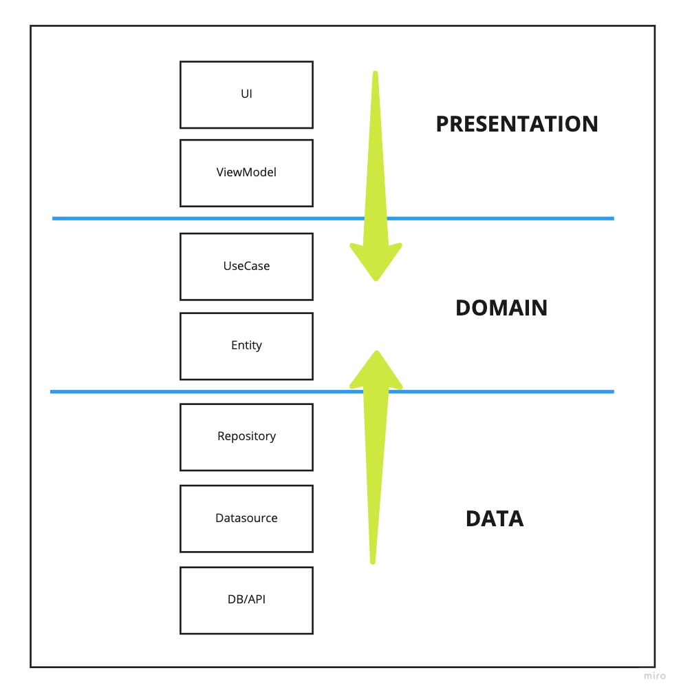
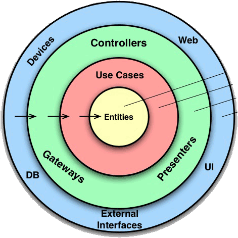
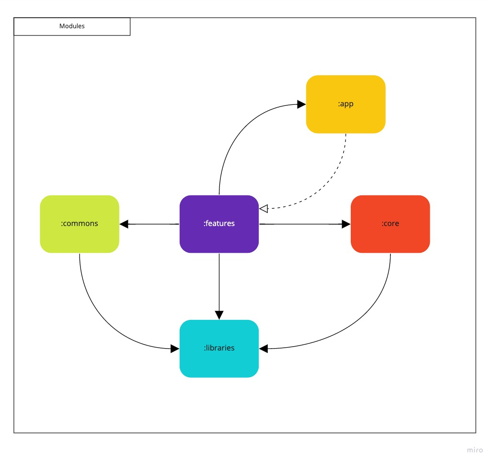
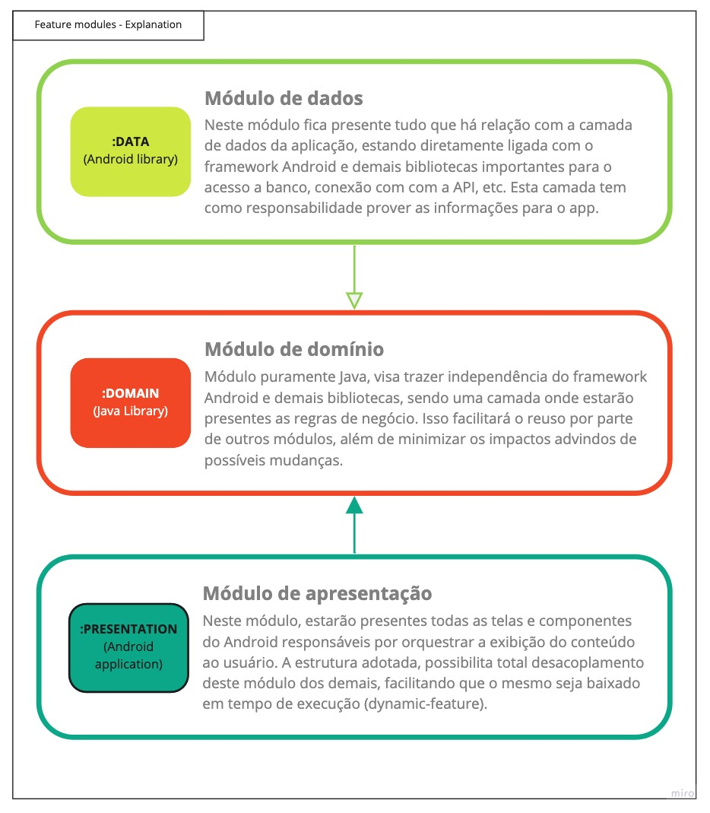
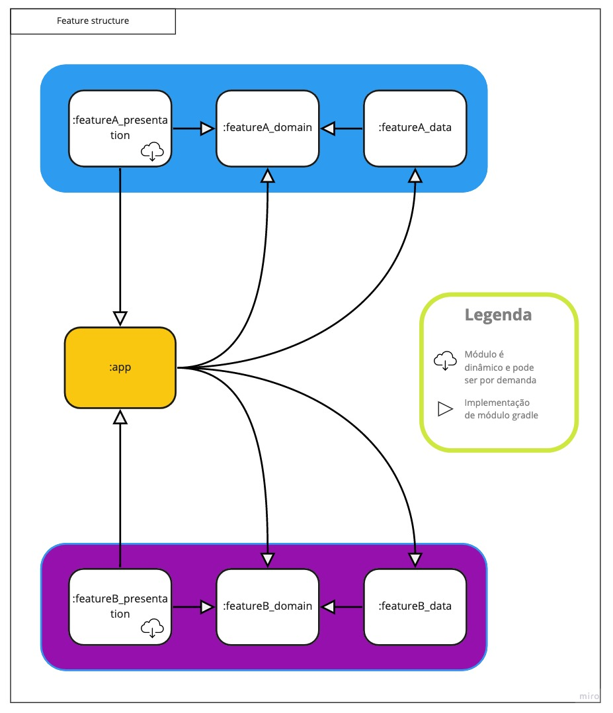

# 🎥 Moovie

[](https://app.bitrise.io/app/50048ce64c66deec)


🚧 &nbsp;EM CONSTRUÇÃO 🚧 

O app ainda está em desenvolvimento e tem como intuito colocar em prática algumas ferramentas e
técnicas que estão em alta no mundo Android, além de melhorar algumas skills. 

A ideia é que usemos os seguintes stack de componentes:

- [X] Dynamic features
- [X] Motion layout
- [X] Navigation
- [X] Coroutines
- [X] ViewModel
- [X] Single Activity
- [X] Dagger 2
- [X] Mockk
- [X] JUnit
- [X] Jenkins / Bitrise
- [ ] MVI
- [ ] Paging
- [ ] Espresso
- [ ] Compose

## 💻  Configuração de ambiente

Primeiro de tudo, você vai precisar da versão 2020.3.1 (ou superior) do Android Studio e o Java 11.

Crie uma chave de desenvolvedor na API [TheMovieDB](https://www.themoviedb.org/?language=pt-BR) para conseguir rodar o projeto.

Quando você estiver com a chave, adicione ela no arquivo `local.properties` na raiz do projeto, da seguinte forma:

```properties
#TheMovieDB API KEY
api.key=<insert-here>
```
<br>

## :house: Como foi pensada a arquitetura do projeto?

O projeto segue os conceitos da clean architecture, visando maior desacoplamento, facilidade na manutenção, estrutura de pacotes e módulos com responsabilidades bem definidas, aplicação altamente testável, etc.

Abaixo vemos a ligação entre as camadas da aplicação e a quais módulos cama uma pertence.

Arquitetura do app            |  Clean architecture
:-------------------------:|:-------------------------:
  |  


## 🚀 Quais os módulos temos no projeto?



- **Módulo app:** possui a estrutura de navegação e a parte central da injeção de dependencias.
- **Módulo core:** centraliza componentes cruciais para toda a aplicação, como configurações de rede,
  banco, injeção de depêndencias, etc.
- **Módulo commons:** possui estruturas comuns para a aplicação, como componentes, definições base,
  estilos, widgets, etc.
- **Módulos de libraries:** são módulos que podem ser extraídos e usados por outras aplicações, são
  interessantes pois fomentam a criação de bibliotecas para a comunidade Android.
- **Módulos de features:** são módulos dividos em três partes que são explicados abaixo.

## 💡 Como é estruturada uma feature?

As features são divididas em três pacotes, visando um maior desacoplamento entre framework e regras de negócio. Abaixo veremos uma explicação de cada um desses módulos e como é a ligação entre eles.



Foram criados plugins gradle em groovy para cada um dos tipos de módulo.
- moovie.feature-data
- moovie.feature-presentation
- moovie.feature.domain

## ☕ Como é a comunição entre os módulos de feature e app?

A comunicação é descrita no desenho abaixo e foi pensada de modo a possibilitar que tenhamos módulos de apresentação dinâmicos.



## 🐛 Geração de versão e demais configurações gradle

Para gerar novas versões e facilitar o incremento da versão por parte da ferramenta de deploy que no nosso caso é o Jenkins, foi feito uma task do gradle chamada "generateNewVersion".
Os arquivos gradle ainda nao foram totalmente revisados e podem conter melhorias.

## 😄 Seja um dos contribuidores<br>

Quer fazer parte desse projeto? Abra uma PR com sua contribuição.

## 📝 Licença

Esse projeto está sob licença. Veja o arquivo [LICENÇA](LICENSE.md) para mais detalhes.

[⬆ Voltar ao topo](#-moovie)<br>

